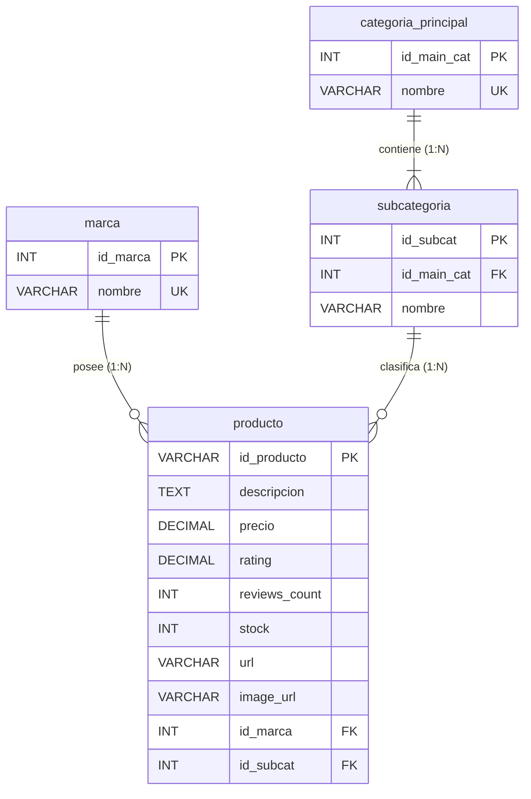

Tech Products E-commerce

Plataforma de catalogo de productos tecnologicos basada en datos de Amazon. El sistema implementa una arquitectura desacoplada Modelo-Vista-Controlador (MVC) en 3 capas, conectando un frontend interactivo con una API RESTful en Flask y una base de datos relacional MySQL normalizada.

---

## Estructura y Organizacion del Proyecto

El codigo se encuentra estrictamente organizado para separar responsabilidades y prevenir el antipatron de monolito:

```text
ecommerce/
|
+-- app.py                             # Inicializador y servidor Flask
+-- .env.example                       # Plantilla de configuracion (sin secretos)
+-- requirements.txt                   # Dependencias Python
+-- config/
|   +-- config.py                      # Configuracion y variables .env
+-- controllers/                       # Rutas HTTP y Blueprints
+-- models/                            # Acceso a datos y consultas SQL
+-- services/                          # Reglas de negocio
+-- templates/                         # Vistas HTML renderizadas por Flask
+-- static/                            # JavaScript y estilos del frontend
+-- conjunto_datos/
|   +-- amazon_tech_products_ecommerceGKALI.csv # Dataset fuente
|
+-- database/                          # Scripts de Base de Datos y Pipeline ETL
|   +-- schema.sql                     # DDL de creacion de tablas y restricciones en MySQL
|   +-- 02_seeds.sql                   # Datos precargados en SQL puro (INSERT masivo)
|   +-- import_csv.py                  # Script ETL automatizado via Python (CSV -> MySQL)
|   +-- generate_inserts.py            # Genera 02_seeds.sql leyendo el CSV
|   +-- load_data.py                   # Carga alternativa con pandas + mysql-connector
|   +-- queries.sql                    # Consultas de validacion, metricas y pruebas
|
+-- docs/                              # Documentacion Tecnica y Diagramas
    +-- diagramas.md                   # Diagramas MER, MVC, ETL y Secuencia (Mermaid)
```

---

## ENTREGABLES GRUPO CHILL: Diseno de API, Arquitectura y Backend

### 1. Blueprint Arquitectonico y Separacion de 3 Capas
- **Capa de Presentacion (Frontend):** `index.html`, `styles.css` y `app.js`. Consume la API mediante llamadas asincronas (`fetch`). Cuenta con control de estados (carga, resultados, modal y badge de conexion).
- **Capa de Controladores:** Ubicada en `controllers/`. Recibe las peticiones HTTP, extrae parametros, delega a los servicios correspondientes y responde codigos de estado estandarizados (200, 201, 400, 404, 500).
- **Capa de Logica y Servicios:** Ubicada en `services/`. Valida tipos de datos, restringe precios negativos o inventarios invalidos, y aplica ordenamientos dinamicos.
- **Capa de Modelos y Datos:** Ubicada en `models/`. Ejecuta sentencias SQL parametrizadas para evitar inyeccion SQL.

### 2. Tabla de Endpoints y Contrato de la API (/api/v1)

| Metodo | Ruta | Parametros Query / Path | Descripcion | Codigos HTTP |
|---|---|---|---|---|
| GET | /api/v1/salud | Ninguno | Estado operativo de la API y de la base de datos | 200, 503 |
| GET | /api/v1/estadisticas | Ninguno | Totales de productos, marcas, categorias y promedios | 200, 500 |
| GET | /api/v1/marcas | Ninguno | Listado de marcas con conteo de productos | 200, 500 |
| GET | /api/v1/categorias | Ninguno | Arbol de categorias principales con subcategorias anidadas | 200, 500 |
| GET | /api/v1/productos | `page`, `limit`, `marca`, `categoria`, `subcategoria`, `min_rating`, `q`, `sort` | Catalogo paginado con busqueda y filtros dinamicos | 200, 500 |
| GET | /api/v1/productos/{id} | Path: `id` | Detalle completo de un producto especifico | 200, 404 |
| POST | /api/v1/productos | Body JSON | Registro de un nuevo producto con validacion de negocio | 201, 400, 500 |
| PUT | /api/v1/productos/{id} | Path: `id`, Body JSON | Actualizacion parcial o total de atributos del producto | 200, 400, 404 |
| DELETE| /api/v1/productos/{id} | Path: `id` | Eliminacion logica o fisica de un producto | 200, 404, 500 |

---

## ENTREGABLES GRUPO MATRIX: Base de Datos MySQL y Proceso ETL

**Integrantes:** Juan Jose Herrera (Lider), Francisco Manuel Bermudez, Rafael Angel Hernandez

### 1. Modelo Entidad-Relacion (MER)
El diseno relacional se encuentra normalizado en Tercera Forma Normal (3NF) y garantiza integridad referencial con claves primarias y foraneas:



### 2. Proceso de Carga y Validacion (CSV a MySQL)
1. **Definicion de Estructura:** `database/schema.sql` crea la base de datos `ecommerce_db` y sus tablas con restricciones `NOT NULL`, `UNIQUE` y cascadas de actualizacion.
2. **Script de Ingestion ETL:** `database/import_csv.py` lee `conjunto_datos/amazon_tech_products_ecommerceGKALI.csv`, limpia valores numericos y de texto, inserta las entidades maestras (`marca`, `categoria_principal`, `subcategoria`) y finalmente vincula los 3,718 productos por lotes transaccionales de 500 registros.
3. **Validacion de Integridad:** `database/queries.sql` contiene consultas para asegurar que no existan registros huerfanos y reportar metricas clave.

---

## Guia de Instalacion y Ejecucion

### Requisitos

- Python 3.10 o superior.
- MySQL 8.0 o superior para el modo MySQL. Si no hay conexion, la API utiliza SQLite local.

Windows (PowerShell):
```powershell
python -m venv .venv
.venv/Scripts/Activate.ps1
python -m pip install -r requirements.txt
```

Linux/macOS:
```bash
python3 -m venv .venv
source .venv/bin/activate
python -m pip install -r requirements.txt
```

### Paso 1: Configurar la Base de Datos en MySQL
Abre tu cliente MySQL (MySQL Workbench, phpMyAdmin o terminal) y ejecuta el archivo DDL:
```bash
mysql -u root -p < database/schema.sql
```

### Paso 2: Configurar el entorno

Crea el archivo local de variables a partir de la plantilla y coloca credenciales validas de MySQL. Este archivo esta ignorado por Git y no debe publicarse. Sin credenciales validas, la aplicacion usa SQLite e informa el motivo en `/api/v1/salud`.

Windows (PowerShell):
```powershell
Copy-Item .env.example .env
```

Linux/macOS:
```bash
cp .env.example .env
```

### Paso 3: Poblar la Base de Datos (elige una opcion)

Hay tres metodos disponibles, de mayor a menor conveniencia:

**Opcion A — SQL directo (mas rapido, sin Python):**
Ejecuta el archivo de seeds precargado directamente en MySQL. No requiere el CSV ni Python.
```bash
mysql -u root -p ecommerce_db < database/02_seeds.sql
```

**Opcion B — Script Python ETL (recomendado para produccion):**
Lee el CSV, normaliza los datos y los inserta por lotes transaccionales. Toma las credenciales de `.env`.
```bash
python database/import_csv.py
```

**Opcion C — Script pandas (alternativo):**
Usa pandas para procesar el CSV e insertar via `mysql-connector`. Util si se modifica el CSV fuente.
```bash
# Requiere pandas instalado
uv pip install pandas --python .venv
python database/load_data.py
```

**Regenerar 02_seeds.sql desde el CSV (si se cambia el archivo de datos):**
```bash
python database/generate_inserts.py
```


Las opciones B y C leen la configuracion local de `.env`.

### Paso 4: Iniciar la aplicacion Flask (Frontend + API)
```bash
# Iniciar el servidor Flask con la vista MVC y la API REST
python app.py
```
Abre `http://localhost:5000` para la tienda. La API REST queda disponible en `http://localhost:5000/api/v1`.
La barra superior mostrara el motor activo. Consulta `/api/v1/salud` para ver el estado y el motivo de cualquier fallback a SQLite.

---

## Diagramas Tecnicos Completos
Para revisar los diagramas de arquitectura C4, modelo de componentes, flujo ETL y secuencia detallada de peticiones HTTP, consulta el archivo [docs/diagramas.md](docs/diagramas.md).
