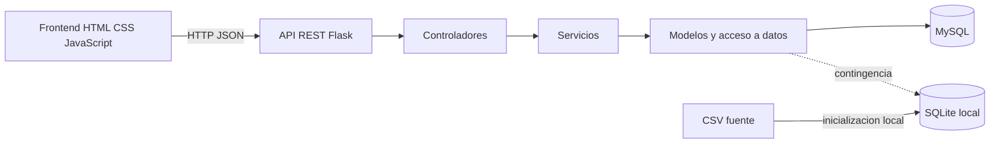
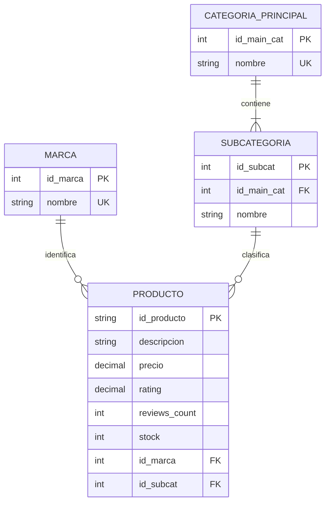
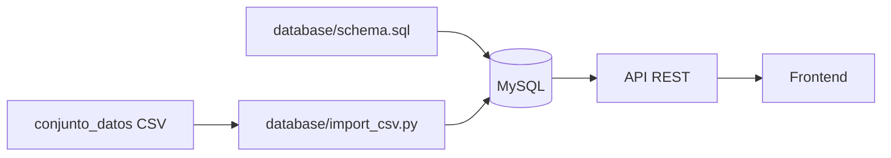

# Arquitectura y modelo de datos

## Componentes

La API expone rutas bajo `/api/v1`. La capa de servicios valida las operaciones y
la capa de modelos ejecuta consultas parametrizadas. Si MySQL no esta disponible,
la API puede inicializar SQLite a partir del CSV local.

## Modelo relacional

## Flujo de importacion

